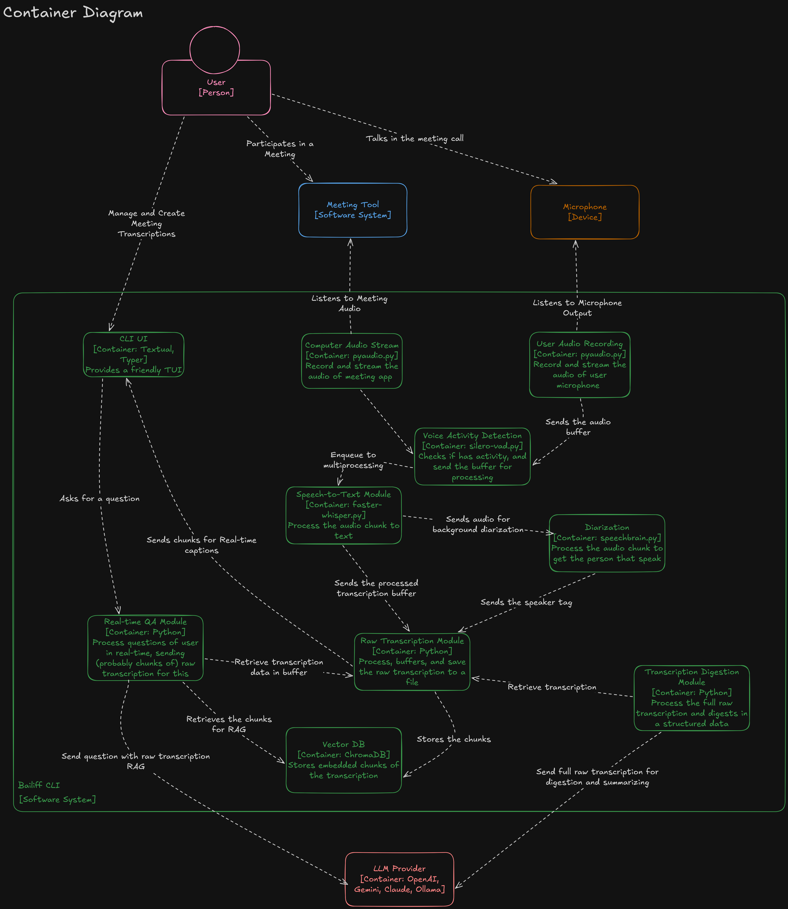

<div align="center">

# 🛡️ Bailiff
### The Local-First, AI-Powered Meeting Assistant


</div>

---

## 📖 About

**Bailiff** is a privacy-focused, offline meeting assistant that runs entirely on your computer. Unlike cloud-based solutions (Otter.ai, Fireflies), Bailiff processes audio locally, ensuring sensitive data never leaves your machine.

It combines real-time transcription, speaker diarization, and a local RAG (Retrieval-Augmented Generation) system to allow users to "chat" with their meeting history.

## Key Features

-   **Real-time Transcription**: Uses `faster-whisper` for high-performance, local speech-to-text.
-   **Speaker Diarization**: Identifies different speakers using `SpeechBrain` embeddings and clustering.
-   **Local RAG (Retrieval-Augmented Generation)**: Stores meeting context in a vector database (`ChromaDB`) for semantic search.
-   **AI Assistant**: Interact with your meeting data using local LLMs (via `Ollama` or compatible APIs).
-   **Privacy-First**: Designed to run entirely offline, keeping your sensitive voice data secure.
-   **Terminal User Interface (TUI)**: A rich, keyboard-centric interface built with `Textual`.

## Prerequisites

-   **Python 3.10+**: Ensure you have a compatible Python version installed.
-   **System Audio Capture (Windows)**: Bailiff uses `pyaudiowpatch` which is specific to Windows for capturing loopback audio.
-   **Ollama**: For the locally AI Assistant features, you need a running instance of [Ollama](https://ollama.com/) with the required models.
    - You can also set any OpenAI compatible cloud API, for this, follow the specific instructions of your LLM provider to get the API key and base URL.

## Installation

1. **Clone the repository:**
```bash
git clone https://github.com/ricardovinicius/bailiff.git
cd bailiff

```

2.  **Create a virtual environment**:
```bash
python -m venv .venv
source .venv/bin/activate  # On Windows: .venv\Scripts\activate
```

3. **Install the package:**
```bash
pip install .
```

4. **Install PyTorch with CUDA support** (Recommended for performance):
Follow the instructions at [pytorch.org](https://pytorch.org/get-started/locally/) to install the correct version for your system.

## Configuration

Bailiff uses environment variables for configuration.

1.  Copy the example environment file:
```bash
    cp .env.example .env
```

- Edit `.env` to configure your settings:
    - `BAILIFF_MODELS__LLM_API_KEY`: API key for your LLM provider. (if using OpenAI compatible cloud API)
    - `BAILIFF_MODELS__LLM_BASE_URL`: URL of your Local LLM provider (default: `http://localhost:11434/v1` for Ollama).
    - `BAILIFF_APP__LOG_LEVEL`: Logging verbosity.

See `bailiff/core/config.py` for all available configuration options.

## Usage

To start the application:

```bash
bailiff
```

This will launch the TUI. You can start a new meeting, view transcriptions live, and ask questions to the assistant about the current conversation.

## Architecture

Bailiff uses a multiprocessing pipeline architecture:

-   **Ingest**: Captures system audio (loopback) and microphone input.      
-   **Fan-out**: Duplicates audio streams for parallel processing.
-   **Transcription**: Converts audio to text using `faster-whisper`.
-   **Diarization**: Extract speaker embeddings and clusters them to identify speakers.
-   **Merge**: Synchronizes transcription segments with speaker labels.
-   **Memory/Assistant**: Indexes text for search and provides an AI interface.



## Contributing

Contributions are welcome! Please feel free to submit a Pull Request.

## References

A special thanks to the following projects:
- SpeechBrain: https://github.com/speechbrain/speechbrain
- Faster Whisper: https://github.com/SYSTRAN/faster-whisper
- Silero VAD: https://github.com/snakers4/silero-vad

And to every other Open Source project that i used in this project.

## 📄 License

[MIT](https://choosealicense.com/licenses/mit/)
